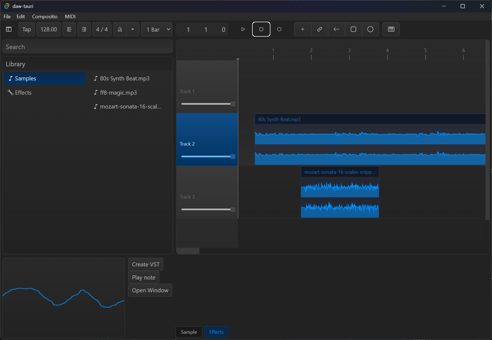

# Rust DAW

A native DAW with a Rust backend and ReactJS frontend using the Tauri framework.

> ⚠️ This is a personal research project for educational purposes. It's still missing a lot of features and error handling that'd make it a viable DAW. I wouldn't recommend this for professional production, but feel free if you're just curious or a fellow dev.

## 🎛️ Features

- Low level audio I/O using [cpal](https://crates.io/crates/cpal)
- Multi-track composition
- Audio file export (`.wav` via [hound](https://crates.io/crates/hound))
- Effects library
- VST3 Support
- MIDI input for playback

## 🧑‍💻Development

### Requirements

- Rust
- NodeJS
- pnpm

### Getting Started

1. `pnpm install`
1. `pnpm tauri dev`

The DAW should open up as a native desktop window.

It comes preloaded with some samples, you can add more in `/data/audio/`.

## 📚 Learn more

Interested in how this works? I've written [a series of blog posts](https://whoisryosuke.com/blog/tagged/rust-daw/) that covers the development from start to...well wherever we're currently at.

- [Low-level Audio Playback](https://whoisryosuke.com/blog/2026/creating-a-daw-in-rust)
- [Multi-Track Timeline](https://whoisryosuke.com/blog/2026/creating-a-daw-in-rust-multi-track-timeline/)
